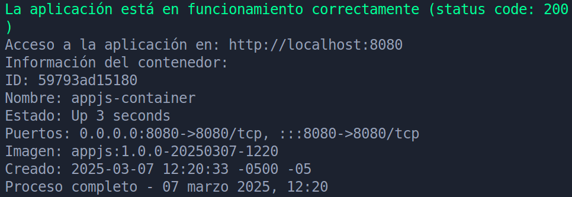
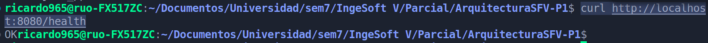
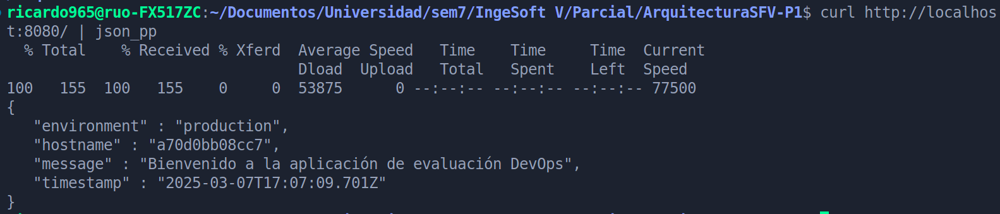

# ArquitecturaSFV-P1

# Evaluación Práctica - Ingeniería de Software V

## Información del Estudiante

- **Nombre: Ricardo Urbina Ospina**
- **Código: A00395489**
- **Fecha: 7 de marzo de 2025**

## Resumen de la Solución

He creado un entorno Docker para ejecutar una aplicación Node.js con Express. El Dockerfile usa una imagen base de Node.js en Alpine y sigue una estrategia de construcción en dos etapas para optimizar el tamaño de la imagen final. Se crea un usuario no root para mayor seguridad, y la aplicación se ejecuta bajo este usuario.

El `.dockerignore` excluye archivos y directorios innecesarios para reducir el tamaño del contexto de construcción.

El script Bash automatiza la construcción, etiquetado y despliegue del contenedor. Primero, crea la imagen con varias etiquetas, luego elimina cualquier contenedor previo con el mismo nombre y ejecuta la nueva instancia con variables de entorno configuradas. Finalmente, valida el estado de la aplicación verificando el endpoint `/health` y muestra información relevante sobre el contenedor.

## Dockerfile

El Dockerfile lo planteé de la siguiente forma:

```bash
FROM node:18-alpine AS builder
WORKDIR /app
COPY package*.json ./
RUN npm install --only=production
FROM node:18-alpine
RUN addgroup -S appgroup && adduser -S appuser -G appgroup
WORKDIR /app
COPY --from=builder /app/node_modules ./node_modules
COPY app.js ./
RUN chown -R appuser:appgroup /app
USER appuser
ENTRYPOINT ["node", "app.js"]
```

Primero, hice un build en dos etapas porque así consigo una imagen final más pequeña. En la primera etapa instalo todas las dependencias y en la segunda solo copio lo necesario para ejecutar lo minimo.

Respecto a las instrucciones relacionadas con el usuario (`addgroup`, `adduser`, `chown` y `USER`) son prácticas de seguridad que implementan el principio de seguridad de "privilegio mínimo", para evitar que si el contenedor se ve comprometido, el usuario tenga permisos de root. Hago que Docker corra el `node app.js` con un usuario con permisos mínimos por las razones de seguridad previamente mencionadas.

## Script de Automatización

Este script es un automatizador para construir, desplegar y verificar una aplicación Node.js en un contenedor Docker.

Primero, defino algunas variables clave, como el nombre de la imagen, la versión y el puerto en el que correrá la aplicación. También configuro colores para mejorar la legibilidad en la terminal.

Luego, construyo la imagen de Docker con varias etiquetas, incluyendo la versión específica, una con la fecha y hora del build, y una etiqueta `latest` para tener un nombramiento semántico y diciente de la imagen.

Después, reviso si el contenedor ya está corriendo. Si es así, lo detengo y elimino para evitar conflictos.

A continuación, ejecuto el contenedor con la nueva imagen, configurando variables de entorno y asegurando que se reinicie automáticamente si falla.

Para verificar que todo está funcionando, espero unos segundos y hago una petición al endpoint `/health`. Si responde con un código 200, muestro información del contenedor y la URL de acceso. Si no, indico que hubo un problema y muestro los logs del contenedor.

Al final, muestro un mensaje con la fecha y hora en la que terminó el proceso.

## Principios DevOps Aplicados

1. **Automatización**  
   Se automatiza la construcción, despliegue y verificación de la aplicación con un script Bash. Esto reduce errores manuales y hace que el proceso sea más rápido y repetible.

2. **Seguridad**  
   Se ejecuta la aplicación con un usuario no root en el contenedor para minimizar riesgos. También propongo mejorar la gestión de variables de entorno con un archivo `.env` o un gestor de secretos para mayor seguridad.

3. **Observabilidad**  
   Se usa el endpoint `/health` para verificar el estado de la aplicación. Además, se considera mejorar el manejo de logs para facilitar la supervisión y detección de problemas. Todo lo anterior contribuye a la etapa de monitoreo.

## Captura de Pantalla

Comprobación de resultado del script

Comprobación del endpoint health a través de CURL

Comprobación de que el contenedor corre con CURL


## Mejoras Futuras

Podría mejorar la implementación de varias maneras:

1. **Gestión de variables de entorno**  
   El script Bash tiene las variables de entorno escritas directamente en el código. Sería mejor usar un archivo `.env` para cargarlas de manera más ordenada. Si hay datos sensibles, se podría usar un gestor de secretos como Vault con autenticación.

2. **Optimización de la imagen Docker**  
   Se podría hacer la imagen aún más liviana eliminando archivos innecesarios después de la instalación o usando `npm ci` en lugar de `npm install` para evitar instalar dependencias que no se necesitan.

3. **Mejor manejo de logs**  
   Ahora mismo, para ver los logs hay que hacer `docker logs`, pero se podría agregar algo más práctico, como guardarlos en un archivo o enviarlos a un servicio externo para revisarlos mejor para mejorar la etapa de monitoreo, incluso utilizar una herramienta más especializada.

## Instrucciones para Ejecutar

Para ejecutar, simplemente debes tener Docker instalado en tu sistema, de lo contrario el script te mostrará un mensaje de error y se cerrará.

Clona este repositorio y le das permisos de ejecución al script llamado deploy.sh con el comando `chmod +x deploy.sh`.

Una vez terminado ello, se debe correr el script con `./deploy.sh` y automaticamente se construirá la imagen, se correrá el contenedor y se comprobará que su funcionamiento sea correcto.

Al final de la ejecución del bash, en pantalla se te mostrará el resultado de la operación y la fecha en que se realizó.
